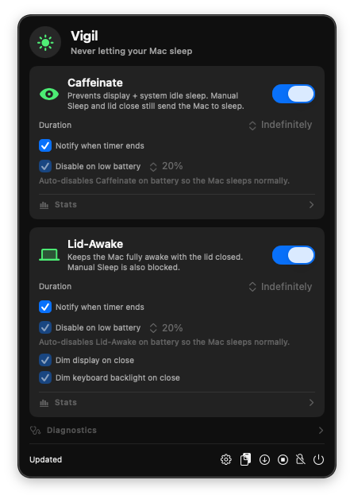
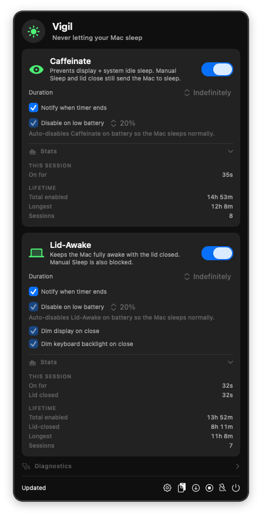

# Vigil

**Keep your Mac awake. On your terms.**

A native macOS menu-bar app that prevents your Mac from sleeping — whether you're running a long export, watching something with the lid open, or stepping away from your closed laptop while a download finishes. No terminal commands. No browser tab tricks. Just a toggle.

<p align="center">
  
  &nbsp;
  
</p>

## Why Vigil

- 🔋 **Won't run your battery flat.** A built-in low-battery floor auto-disables on battery so your Mac can sleep normally instead of dying mid-overnight.
- ⏱️ **Timers that actually stop.** Pick a duration (5 minutes to 5 hours) and Vigil turns itself off when you said it would — even after a system sleep/wake cycle.
- 💻 **Two modes, one app.** *Caffeinate* keeps your screen on while you're at your desk. *Lid-Awake* keeps your Mac fully running with the lid closed.
- 🪶 **Lives in the menu bar.** A single SF Symbol that changes with state — sleeping moon when idle, glowing sun when both modes are armed. Quit the app; your timers keep running.
- 📊 **Knows how long it's been on.** Per-session and lifetime stats — how long this session has run, total time awake across all sessions, longest session ever, total time with the lid closed.
- 🔔 **Tells you when it's done.** Opt-in notification when a timer ends, so you don't come back to a session that quietly stopped an hour ago.
- 🔄 **Updates itself.** Daily background check via Sparkle, signed by Apple's notary service. You're always one click away from the latest version.

## Install

1. Download **`Vigil-X.Y.Z.dmg`** from [the latest release](https://github.com/dbuskariol/vigil/releases/latest).
2. Open the DMG and drag **`Vigil.app`** to the Applications shortcut.
3. Open `Vigil.app` from `/Applications`. The menu-bar icon appears at the top right.

> If you grabbed the `.zip` instead, drag `Vigil.app` to `/Applications` *before* opening it — macOS quarantines apps launched from Downloads, and Vigil refuses to enable from a quarantined path.

## Use it

### From the menu bar

Click the icon to open the popover and toggle either feature:

- **Caffeinate** — keeps the display and system from idling to sleep. Manual Sleep and closing the lid still work as normal. Perfect for video playback, presentations, or a long compile.
- **Lid-Awake** — keeps the Mac fully running with the lid closed. The first time you enable it, macOS asks for your administrator password so Vigil can set this up cleanly. After a one-time **Approve All**, it works without prompts.

Each feature has its own duration menu (Indefinitely, 5/10/15/30 minutes, 1/2/5 hours), a "Notify when timer ends" checkbox, and a **Disable on low battery** toggle that auto-stops the feature once your battery drops to the chosen percentage on battery power.

Open **Stats** in either card for live session and lifetime totals.

### From the command line

After `make install`:

```sh
vigil caffeinate on                       # indefinite
vigil caffeinate on --duration 1h         # one hour, auto-stop
vigil caffeinate on --battery-floor 15    # stop at 15% on battery
vigil caffeinate off

vigil lid-awake on --duration 2h          # two-hour closed-lid run
vigil lid-awake on --battery-floor 20     # stop at 20% on battery
vigil lid-awake off

vigil status                              # human-readable status
vigil status --json                       # machine-readable for scripts
vigil doctor                              # full diagnostics
```

Durations: `indefinite | 5m | 10m | 15m | 30m | 1h | 2h | 5h`. Battery floor: any integer 1–99.

## Smart defaults

- **Lid-Awake refuses to start on battery without confirmation** — closed lid + battery is a heat trap. Click Turn On a second time if you really mean it, or pass `--force-battery` on the CLI.
- **Lid-Awake ships with the battery floor on at 20%** — when you walk away from a closed lid, you almost certainly want the Mac to sleep rather than run dry. Lift the toggle if you don't.
- **Caffeinate's battery floor is off by default** — you're at your desk; auto-disabling mid-presentation would be more annoying than helpful. Flip it on per session if you want it.
- **The battery-floor trip is one-way.** If Vigil disables itself because the battery hit 20%, plugging back into power doesn't silently re-arm it. You stay in control.
- **Vigil keeps running when you quit it.** Both features are backed by macOS LaunchAgents, so quitting the menu-bar app doesn't stop your in-flight timer or low-battery monitor.

## Stays out of the way

The menu-bar icon switches between four SF Symbols depending on state — sleeping moon when idle, eye when Caffeinate is active, laptop when Lid-Awake is active, sun when both are. A tiny orange dot tells you when setup needs attention. That's it. No notification spam, no analytics, no telemetry beyond Sparkle's daily update check (which sends only `User-Agent: Sparkle/… Vigil/X.Y.Z` and your IP to GitHub).

## Under the hood (for the curious)

Vigil holds Apple's standard IOKit power assertions to keep the system awake, plus — for Lid-Awake — a temporary, reversible `pmset` profile to keep the Mac running with the lid closed. When you turn a feature off (or its timer expires, or the battery floor trips), Vigil restores the exact `pmset` state it captured at enable time.

- The menu-bar app is a pure controller — it shells out to the bundled `vigil` CLI for every action.
- Active features survive menu-app quit, Sparkle updates, and admin password sheets by running as per-feature user LaunchAgents.
- Lid-Awake needs administrator rights (only for the `pmset` profile); Caffeinate needs nothing.
- After one-time **Approve All**, Lid-Awake works without password prompts via a narrowly-scoped sudoers rule limited to `pmset` with an in-binary argument allowlist.

Full design rationale lives in [`docs/0.2.0-design.md`](docs/0.2.0-design.md) (foundational architecture) and [`docs/0.2.2-design.md`](docs/0.2.2-design.md) (battery floor design + dual-model consensus notes). Security policy is in [`SECURITY.md`](SECURITY.md).

## Build from source

```sh
make app                # ad-hoc signed local build
open dist/Vigil.app

swift build -c release  # CLI only
.build/release/vigil status

sudo make install       # install the CLI to /usr/local/bin/vigil
```

Release builds (Developer ID + hardened runtime + notarization + Sparkle keys) are maintainer-only; see [`RELEASING.md`](RELEASING.md).

## License

MIT. See [`LICENSE`](LICENSE).
